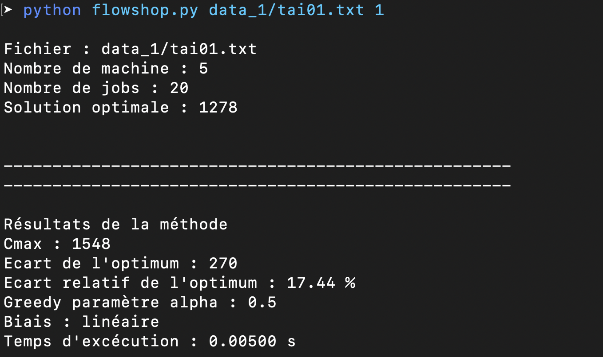

# Flowshop - Implémentation GRASP

Projet d'implémentation de méthodes RO pour résoudre un problème de flowshop. Ce projet consite en l'implémentation de la méthode GRASP (Greedy randomized adaptive search procedure) pour un problème de flowshop dans le cadre d'un cours à IMT Atlantique - Campus Nantes

## Pré-requis

La syntaxe nécessite d'utiliser pyhon 3 pour exécuter le code. Vous pouvez vérifier la version de python avec la commande suivant dans le terminal :

`python --version`

## Organisation du code

Le project contient différents scripts :

* **flowshop.py** : modélisation du flowshop
* **job.py** : modélisation d'un job
* **ordonnancement.py** : classe responsable d'ajouter les jobs ordonnés dans le flowshop
* **grasp.py** : classe appliquant la méthode GRASP au flowshop

## Jeux de données

Les données sont contenues dans les dossiers data_1 et data_2

## Lancement des tests

Les tests se lancent depuis le terminal en lançant le script **flowshop.py** avec deux arguments :

1. Chemin vers le fichier de test
2. Boolean indiquant si l'on souhaite afficher les différentes informations sur le flowshop et les résultats

Exemple de ligne de commande exécutant la méthode sur l'input *data_1/tai01.txt* et affichant la sortie :

`python flowshop.py data_1/tai01.txt 1`

L'affichage dans le terminal est le suivant :

## Résultats

Les meilleures solutions sont sauvegardées dans le dossier **logs**. Ces logs sont automatiquement mis à jour lorsqu'une meilleure est trouvée pour une instance

Remarque : si l'on suite suivre l'évolution de l'algorithme et suivre les choix de l'algorithme à chaque étape il suffit de décommenter la ligne 87 du script **grasp.py**

## Auteurs

* **Gauthier Gris** : Travail inital et implémentation de la méthode GRASP
* **Quentin Depoortere**
* **Etienne Raveau**
* **Jérôme Daulion**
* **Marin Guermeur**

